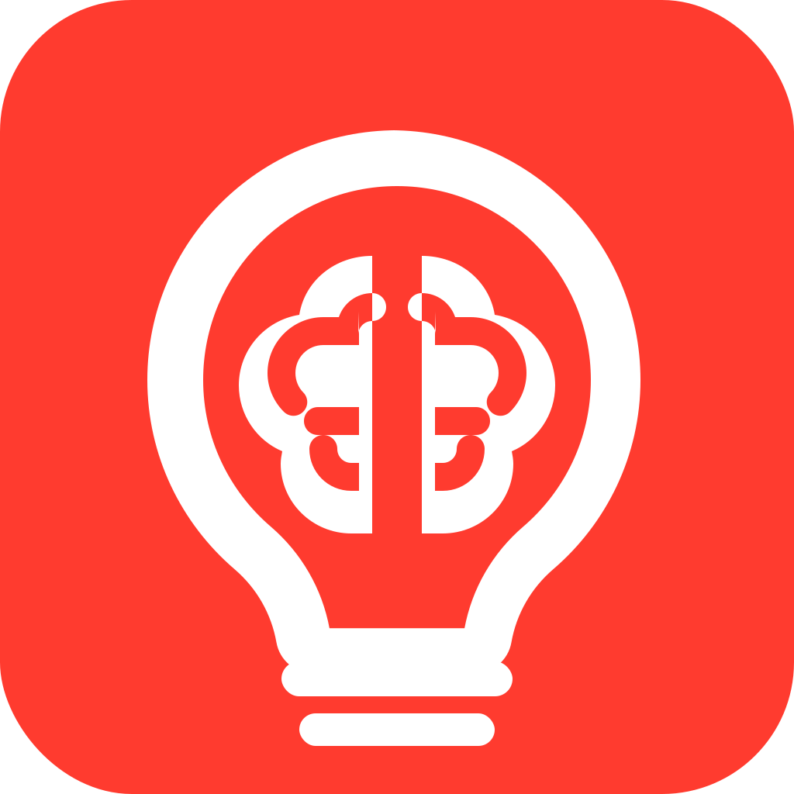

# Nocion Repository



Nocion is a VS Code Chat Participant extension that maintains an LLM-written personal markdown wiki.

This repository contains the extension source code, implementation plan, tests, packaging script, and image assets. For the end-user VS Code extension guide, see [VS_CODE_README.md](VS_CODE_README.md).

## Repository Contents

- `src/` - Extension runtime source.
- `tests/` - Node test suite for routing, wiki operations, Atlassian credentials, metadata, and extension activation.
- `scripts/` - Dependency-free compile and VSIX packaging helpers.
- `images/` - Extension icon assets.
- `PRD.md` - Product requirements.
- `IMPLEMENTATION_PLAN.md` - Implementation plan and testing strategy.
- `VS_CODE_README.md` - End-user README packaged into the VSIX as `README.md`.

## Development

```bash
npm run compile
npm test
npm run package
```

`npm run package` creates `nocion-{version}.vsix`.

## Verification

Before publishing or sharing a VSIX, run:

```bash
npm run compile
npm test
npm run package
unzip -t nocion-0.1.3.vsix
```

The packaged VSIX intentionally includes the end-user VS Code README, not this repository README.

## License

Nocion is open-source software licensed under the [MIT License](LICENSE).
